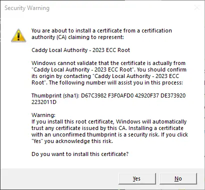

# Windows, Docker, Caddy and localhost
This tutorial will walk you through a number of tasks to realize this development environment:
1. Create a [Go-based Application Programming Interface](#step-1-go-based-application-programming-interface) with multiple routes
2. Add support for [static content including a Single Page App](#step-2-go-server-for-static-files-and-spa)
3. Create an [SPA that accesses the API](#step-3-single-page-application-and-static-files) to grab web pages and display an OpenGraph-based link if available
4. [Switch to Caddy Server](#step-4-switch-to-caddy-to-handle-static-files-and-https) to to reverse proxy the API, handle static content and the SPA
5. Wrap everything up in a [Docker environment](#step-5-wrap-everything-up-using-docker) including automatic updating of our Go API Server

I began this journey with Joe Purdy's [My Go development environment with HTTPS and Dynamic Reloading](https://www.purdy.dev/words/basic-go-development-environment-with-https-and-dynamic-reloading/) but I ran into some issues mostly tied to differences in host (Windows vs. Linux) and scope (SPA vs. simple API).

## Steps

The repository represents the finished product of this project. For people interested in working with the concepts as they are introduced this document has been broken into steps. An archive of the project at the end of each step is available within the `./public/steps/` folder.

### Step 1: Go-based Application Programming Interface
This is very much a barebones sample as the ultimate goal of this project is to document the steps necessary to do local web development in a secure container but you have to start somewhere. That brings us here and our first two files:

Go module `go.mod`

```go
module spa

go 1.19
```

API Server `main.go`

```
package main

import (
	"fmt"
	"io"
	"log"
	"math/rand"
	"net/http"
	"strconv"
	"time"
)

func main() {
	http.HandleFunc("/api/v1/key", serviceKey)
	http.HandleFunc("/api/v1/og", serviceOpenGraph)

	fmt.Println("SPA API Server")
	fmt.Printf("Starting API on %s\n", time.Now().Format("Jan 02, 2006 15:04 MST"))
	log.Fatalln(http.ListenAndServe(":3000", nil))
}

func serviceKey(w http.ResponseWriter, r *http.Request) {
	paramLength := r.URL.Query().Get("length")
	if paramLength == "" {
		w.Write([]byte("no length parameter provided"))
		return
	}

	length, err := strconv.Atoi(paramLength)
	if err != nil {
		w.Write([]byte("invalid length parameter: " + paramLength))
		return
	}

	digits := "0123456789"
	specials := "~=+%^*!@#$"
	all := "ABCDEFGHIJKLMNOPQRSTUVWXYZ" +
		"abcdefghijklmnopqrstuvwxyz" +
		digits + specials
	buf := make([]byte, length)
	buf[0] = digits[rand.Intn(len(digits))]
	buf[1] = specials[rand.Intn(len(specials))]
	for i := 2; i < length; i++ {
		buf[i] = all[rand.Intn(len(all))]
	}
	rand.Shuffle(len(buf), func(i, j int) {
		buf[i], buf[j] = buf[j], buf[i]
	})

	w.Write(buf)
}

func serviceOpenGraph(w http.ResponseWriter, r *http.Request) {
	paramURL := r.URL.Query().Get("url")
	if paramURL == "" {
		w.Write([]byte("no url parameter provided"))
		return
	}

	req, err := http.NewRequest("GET", paramURL, nil)
	if err != nil {
		errString := "url get error: " + err.Error()
		w.Write([]byte(errString))
		return
	}

	cli := http.Client{}
	res, err := cli.Do(req)
	if err != nil {
		errString := "http client error: " + err.Error()
		w.Write([]byte(errString))
		return
	}

	if res.StatusCode < 200 || res.StatusCode > 299 {
		errString := "http status error: " + res.Status
		w.Write([]byte(errString))
		return
	}

	body, err := io.ReadAll(res.Body)
	res.Body.Close()
	if err != nil {
		errString := "http body error: " + err.Error()
		w.Write([]byte(errString))
		return
	}

	w.Write([]byte(body))
}
```
We now have a server listening on port 3000 for two API routes, `/api/v1/key` and `/api/v1/og`. "Key"  returns a random string of the `length` specified in that parameter, and "OG" returns the contents of a URI specified in the `url` parameter. To test this first step enter `go run main.go` then in your browser try `http://localhost:3000/api/v1/key?length=25` to see things working. What happens when you try the "url" route? 😛

### Step 2: Go Server for Static Files and SPA
The title of this piece says Caddy will be serving our full website but for the moment we're going to temporarily use our API server to also serve static files and the SPA that will complete our development sandbox. Our API doesn't change but the top of `main.go` gets expanded:
```go
package main

import (
	"fmt"
	"io"
	"io/fs"
	"log"
	"math/rand"
	"net/http"
	"os"
	"strconv"
	"strings"
	"time"
)

func main() {
	http.HandleFunc("/api/v1/key", serviceKey)
	http.HandleFunc("/api/v1/og", serviceOpenGraph)

	var frontend fs.FS = os.DirFS("public")
	httpFS := http.FS(frontend)
	fileServer := http.FileServer(httpFS)
	serveIndex := serveFileContents("index.html", httpFS)

	http.Handle("/", intercept404(fileServer, serveIndex))

	fmt.Println("SPA API Server")
	fmt.Printf("Starting API on %s\n", time.Now().Format("Jan 02, 2006 15:04 MST"))
	log.Fatalln(http.ListenAndServe(":3000", nil))
}

func intercept404(handler, on404 http.Handler) http.Handler {
	return http.HandlerFunc(func(w http.ResponseWriter, r *http.Request) {
		hookedWriter := &hookedResponseWriter{ResponseWriter: w}
		handler.ServeHTTP(hookedWriter, r)

		if hookedWriter.got404 {
			on404.ServeHTTP(w, r)
		}
	})
}

type hookedResponseWriter struct {
	http.ResponseWriter
	got404 bool
}

func (hrw *hookedResponseWriter) WriteHeader(status int) {
	if status == http.StatusNotFound {
		// Don't actually write the 404 header, just set a flag.
		hrw.got404 = true
	} else {
		hrw.ResponseWriter.WriteHeader(status)
	}
}

func (hrw *hookedResponseWriter) Write(p []byte) (int, error) {
	if hrw.got404 {
		// No-op, but pretend that we wrote len(p) bytes to the writer.
		return len(p), nil
	}

	return hrw.ResponseWriter.Write(p)
}

func serveFileContents(file string, files http.FileSystem) http.HandlerFunc {
	return func(w http.ResponseWriter, r *http.Request) {
		// Restrict only to instances where the browser is looking for an HTML file
		if !strings.Contains(r.Header.Get("Accept"), "text/html") {
			w.WriteHeader(http.StatusNotFound)
			fmt.Fprint(w, "404 not found")

			return
		}

		// Open the file and return its contents using http.ServeContent
		index, err := files.Open(file)
		if err != nil {
			w.WriteHeader(http.StatusNotFound)
			fmt.Fprintf(w, "%s not found", file)

			return
		}

		fi, err := index.Stat()
		if err != nil {
			w.WriteHeader(http.StatusNotFound)
			fmt.Fprintf(w, "%s not found", file)

			return
		}

		w.Header().Set("Content-Type", "text/html; charset=utf-8")
		http.ServeContent(w, r, fi.Name(), fi.ModTime(), index)
	}
}
```
In order to add support for serving static files and a Single Page Application we nned to focus on this block of Go code:
```go
	var frontend fs.FS = os.DirFS("public")
	httpFS := http.FS(frontend)
	fileServer := http.FileServer(httpFS)
	serveIndex := serveFileContents("index.html", httpFS)

	http.Handle("/", intercept404(fileServer, serveIndex))
```
It's here that we hook into the file system for our static folder root, `public`, and SPA file `index.html`. Go's built-in `FileServer` will handle all non-`html` files while `intercept404` will ensure local navigation will always be sent to `index.html`.

Please check out Trevor Taubitz's [Serving Single-Page Apps From Go](https://hackandsla.sh/posts/2021-11-06-serve-spa-from-go/) if you're interested in more about how this functionality is being handled. Our Go server is now ready to serve both our API and static files, so it's time to add those components to our project.

### Step 3: Single Page Application and Static Files

The SPA, a simple `index.html`, is one of a few basic files that will make up our static site. In addition to [The New CSS Reset](https://github.com/elad2412/the-new-css-reset) we will have our own CSS, JavaScript and an image to test our updated Go server. All of these files are placed in the folder `public` at the root of our project.

What else goes in the root? A few `favicon` permutations of course, and we're not skimping here. Starting with Andrey Sitnik's [How to Favicon in 2023: Six files that fit most needs](https://evilmartians.com/chronicles/how-to-favicon-in-2021-six-files-that-fit-most-needs) and a generic SVG logo head over to Philippe Bernard's [RealFaviconGenerator](https://realfavicongenerator.net/) to generate more than what we need.

With these ecoutraments out of the way let's look at what is going on with our SPA.

This is a vanilla JavaScript SPA meaning we aren't using and libraries or frameworks to deliver functionality encapsulated into container elements of our HTML document. One of the benefits of this approach is taking advantage of in-browser conceptualization and design. In our example we have four "web pages" each contained within a `section` element. During development each of these "pages" appears stacked on top of each other to help finalize styles.

### Step 4: Switch to Caddy to Handle Static Files and https
Here we use Caddy locally along with our GO API server. Nothing changes functionality-wise but we get a rock-solid web server for our project thanks to a single download and file. Head over to the [Caddy Download Page](https://caddyserver.com/download) and grab the right version for your operating system the create a `Caddyfile` which serves as the configuration:

```json
{
	http_port 2010
	servers :2015 {
		listener_wrappers {
			http_redirect
			tls
		}
	}
}
https://localhost:2015 {
	encode zstd gzip

	handle /api/* {
		reverse_proxy localhost:3000
	}

	handle {
		root * public
		try_files {path} index.html
		file_server
	}
}
```

All we care about is HTTPS which Caddy will handle for us automatically. If you're not already running a web server this configuration would be much simpler but let's go with custom ports to avoid conflicts. The first section is for globals. The `http_port` is necessary because we're not using the conventional `80` and `443` and we're always forcing HTTPS but Caddy needs some port defined. The `servers :2015` block tells Caddy to forward all traffic to HTTPS and ensure there is an SSL certificate. The second section defines the behavior of our server, in this case adding compression to files, redirecting all calls to `/api/` to our Go server, and finally replacing what we had added to the Go server for static files and the SPA.

Now comes the tricky part which will only matter for this step: running two executables. If you're in Visual Studio Code it's easy enough to open multiple terminals but however you want to do it you need to run both `go run main.go` and 'caddy run`. If you have never used Caddy before you'll be prompted to save the certificate needed for HTTPS. On Windows you'll see something like this:



After the certificate is good you can now browse the site at `https://localhost:2015`. We're back to the same functionality we had in Step 3, but with two servers that we're about to wrap up inside a container.

### Step 5: Wrap Everything Up Using Docker

While we could continuing our development using two shells to run Caddy and our API server. This is especially easy in VSCode thanks to the multiple terminal support. Instead we are going to use Docker to deliver a single execution point that delivers live recompiling of our API and a web server with SSL to continue development.

After installing [Docker Desktop](https://www.docker.com/) and having it running we can develop a `Dockerfile` to execute commands needed to construct our environment as well as a `docker-compose.yml` file to define how the two containers, Caddy and our API, are accessible from the package.

The final addition to our formula is the introduction of [☁️ Air - Live reload for Go apps](https://github.com/cosmtrek/air). With this or a similar tool we can keep Docker running after making changes to our API server. To configure Air we need a `.air.toml` file:

```toml
[build]
cmd = "go build -o ./tmp/spa ."
bin = "tmp/spa"
exclude_dir = ["public","docs"]
```

This is fairly basic, issuing our previous `go build` command but now directing the output to a `tmp` folder; pointing to that folder as the location of the executable; and execluding the folders that are not part of the Go-based API server.

While Air provides its own image we're going to use the basic Go version instead so we need to establish the environment using a `Dockerfile`:

```sh
FROM golang:1.19

WORKDIR /app

RUN go install github.com/cosmtrek/air@latest

COPY go.mod ./
RUN go mod download

CMD ["air", "-c", ".air.toml"]
```

Here we're requesting an image of 1.19 version of Go and setting a working folder for the container. Into this folder we're installing Air, copying `go.mod` and downloading relevant modules. Finally we're starting up Air and loading our configuration file. These actions will serve as the basis for our Go container. For better explanations of each of these directives please check out the official documentation [Dockerfile reference](https://docs.docker.com/engine/reference/builder/).

We're almost there, just the Docker Compose configuration `docker-compose.yml` file remains:

```yml
version: "3.8"
services:
  go:
    build: ./
    ports:
      - "3000"
    volumes:
      - ./:/app
  caddy:
    image: caddy:latest
    restart: on-failure
    ports:
      - "2010:2010"
      - "2015:2015"
      - "2019:2019"
    volumes:
      - ./Caddyfile:/etc/caddy/Caddyfile
      - ./public:/srv
      - caddy_data:/data
      - caddy_config:/config
volumes:
  caddy_data:
    external: true
  caddy_config:
```

Our two containers, described as services here, take advantage of both a `Dockerfile` build and a Docker image. Our `go` service uses the `build` directive set to the root of our project from which it uses the `Dockerfile` setup and exposes our API server on port 3000. Our `caddy` service uses official image, requesting the latest version. As this image is defined by another party it has specific parameters necessary for its container to operate. The `ports` correspond to our definitions in `Caddyfile` with one addition, `2019:2019` which maps to Caddy's admin API. This is necessary to store the SSL certificate after Docker is up and running.

Caddy uses a number of `volumes`. Two point directly at files within our project, first our `Caddyfile`, then our `public` folder which Caddy will serve live files. The other two are virtual filesystems Docker will create as defined by the master `volumes` parameters. We can assume the `caddy_config` volume is where active configuration is stored as it is not discussed on the [Caddy Docker Official Image](https://hub.docker.com/_/caddy) page, so we're copying their parameter exactly, but the `caddy_data` volume needs some extra discussion. It is used to store a number of things including SSL certificates. By default Docker creates and destroys volumes upon startup and exit. As we want to persist our certificate across sessions we can take advantage of an `external` Docker volume. These virtual filesystems are created before starting the Docker session for the first time. This can ve done from the command line or more easily from within the Docker Desktop app. Simply choose "Volumes", click the "Create" button and specify `caddy_data`.

We're now ready to start up our new environment by entering this in a terminal:[^[1]^](#appendix-a)

```sh
docker compose up
```

Here's where the `external` volume and Caddy's admin API come into play. Open a second terminal and execute:

```sh
caddy trust --address localhost:2019
```

This should present the same certificate confirmation dialog seen when we introduced Caddy. The difference here is that the SSL information gets stored in the Docker `caddy_data` volume so it will be available any time we start up our package. The fruits of our labor aren't readily visible when we visit `https://localhost:2015` again. But under the hood we can develop any part of our project and have the changes automatically updated in a local version of a production environment.

## Appendix

### Appendix A: Docker compose error

I had the misfortune of getting this error while building this repository that I didn't get during my initial dabbling:

```sh
docker endpoint for "default" not found
```

If it doesn't happen to you that's great, but if it does hit I found a solution in deleting some environment files. I deleted eveything under the local folder `~/.docker/contexts/meta/` which on Windows is `C:\Users\Administrator\.docker\contexts\meta` then restarted Docker Desktop. If you're curious you can see this discussion [Docker Compose: docker endpoint for “default” not found](https://forums.docker.com/t/docker-compose-docker-endpoint-for-default-not-found/134629).
